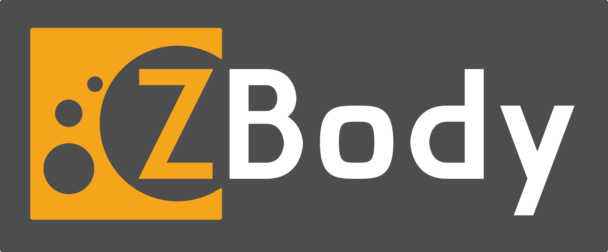

<h1 align="center">
  <br>
  

</h1>

<h4 align="center">Concurrent N-body simulation using Barnes-Hut Algorithm in Zig.</h4>


<p align="center">
  <a href="#key-features">Key Features</a> •
  <a href="#how-to-use">How To Use</a> •
  <a href="#download">Download</a> •
  <a href="#credits">Credits</a> •
  <a href="#license">License</a>
</p>


## Key Features

* Barnes-Hut Algorithm
* Concurrent
* *Faaast*
* Many presets
* Intuitive and smooth controls
* Spawn Astral bodies with just click
* Full screen mode
* Cross platform
  - Linux, macOS, Windows and Web

## How To Use

To clone and run this application, you'll need  [Nix](https://nixos.org/download/) and [Git](https://git-scm.com).
Thats it, no extra stuff required!

> **Note**
> You need nix Flakes enabled.

### Run directly
```bash
$ nix run codeberg:pyranota/Z-body
```

### Install
```bash
$ nix profile install codeberg:pyranota/Z-body
```

### Develop
```bash
# Clone repo
$ git clone https://codeberg.org/pyranota/Z-body

# cd into directory
$ cd Z-body

# Enter development shell
$ nix develop

# Compile and run
$ just

```


## Download

You can [download]() the latest installable version of ZBody for Linux, macOS and windows are NOT avalible.

## Benchmark

TODO

## Credits

This software uses the following open source packages:

- [Zig](https://ziglang.org/)
- [Raylib](https://www.raylib.com/)
- [Tracy](https://github.com/wolfpld/tracy)
- [Hyperfine](https://github.com/sharkdp/hyperfine)
- [Just](just.systems)
- [Nix](https://nixos.org/)


## License

MIT
